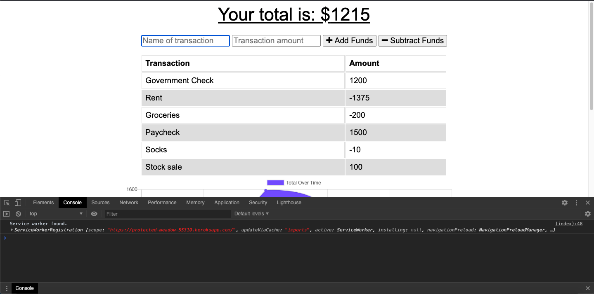

# Budget Tracker PWA
Full-stack node.js Progressive Web App with an Express server, MongoDB database, and Mongoose ODM.

[](https://opensource.org/licenses/MIT)
  
## Description
A Progressive Web App built using node.js, Express, MongoDB, and Mongoose. The app uses a web manifest and service worker to store necessary files into cache storage. This allows the app to run without an internet connection. If working offline, the user's data is stored as a pending object in the user's IndexedDB and the post route is executed when the user's internet connection is re-established, which allows for their data to persist and the app to function even if the user loses connection.

## Table of Contents
* [Installation](#Installation)
* [Usage](#Usage)
* [Images](#Images)
* [Contributing](#Contributing)
* [Credits](#Credits)
* [License](#License)
* [Questions](#Questions)

## Installation
* Clone the repo [here](http://www.github.com/jameygronewald/budgetTrackerPwa) and run  ```npm install```
* Once you have repo cloned and dependencies installed, run  ```node server.js``` in the command line to start server on localhost:3000.

## Usage
1. View the deployed app [here](https://protected-meadow-55310.herokuapp.com/).
2. Enter in the name of your transaction and transaction amount into input fields.
3. Click button to add or subtract funds and see your budget amount update. Also see transactions listed below and graph that updates with your transactions.
4. If working offline, use app as usual, and upon reconnection, you can reload the page and see your transactions persist despite being entered offline.

## Images

### Screenshots


## Contributing
I am the sole contributor on this project.

## Credits
Thanks to GT Coding Bootcamp and Jonathan Watson for providing starter code and walkthrough of buildout, respectively.

## License
MIT License

Copyright (c) [2020] [Jamey Gronewald]

Permission is hereby granted, free of charge, to any person obtaining a copy
of this software and associated documentation files (the "Software"), to deal
in the Software without restriction, including without limitation the rights
to use, copy, modify, merge, publish, distribute, sublicense, and/or sell
copies of the Software, and to permit persons to whom the Software is
furnished to do so, subject to the following conditions:

The above copyright notice and this permission notice shall be included in all
copies or substantial portions of the Software.

THE SOFTWARE IS PROVIDED "AS IS", WITHOUT WARRANTY OF ANY KIND, EXPRESS OR
IMPLIED, INCLUDING BUT NOT LIMITED TO THE WARRANTIES OF MERCHANTABILITY,
FITNESS FOR A PARTICULAR PURPOSE AND NONINFRINGEMENT. IN NO EVENT SHALL THE
AUTHORS OR COPYRIGHT HOLDERS BE LIABLE FOR ANY CLAIM, DAMAGES OR OTHER
LIABILITY, WHETHER IN AN ACTION OF CONTRACT, TORT OR OTHERWISE, ARISING FROM,
OUT OF OR IN CONNECTION WITH THE SOFTWARE OR THE USE OR OTHER DEALINGS IN THE
SOFTWARE.

## Questions
Please direct any questions to jrgronewald@gmail.com, or visit the GitHub repository at https://github.com/jameygronewald/budgetTrackerPwa.